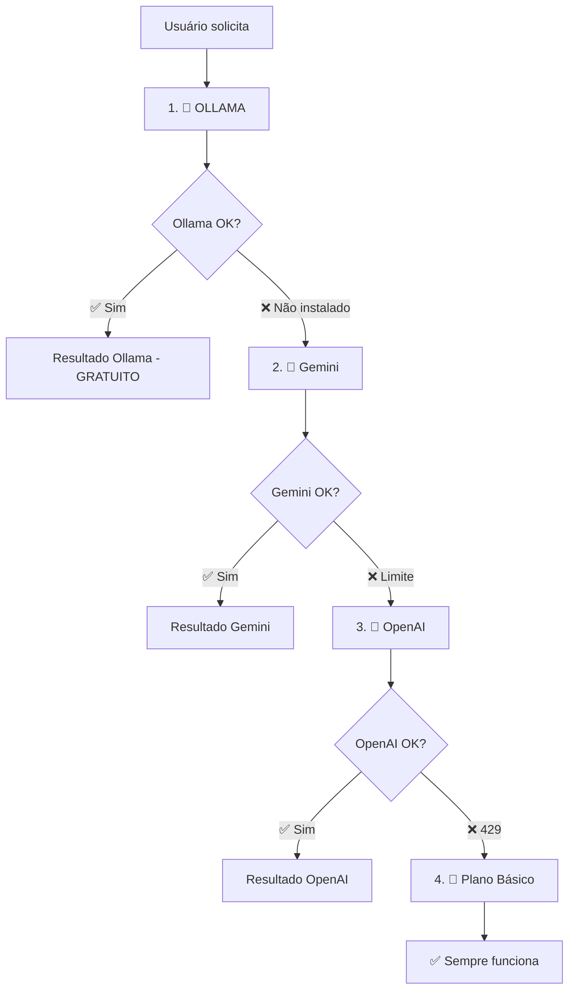

# 🚀 OLLAMA - IA 100% GRATUITA E LOCAL

## ✅ **Por que Ollama é a MELHOR opção?**

- 🆓 **100% GRATUITO** (sem limites, sem créditos)
- ⚡ **SUPER RÁPIDO** (roda no seu PC)
- 🔒 **PRIVADO** (dados não saem do computador)
- 🌐 **SEM INTERNET** (após instalação)
- 🚫 **SEM RATE LIMITS** (use à vontade)
- 💪 **SEMPRE DISPONÍVEL** (não depende de serviços externos)

## 📥 **Instalação (5 minutos)**

### **1. Baixar Ollama**
- **Windows**: https://ollama.ai/download/windows
- Baixe e execute o instalador
- Siga o assistente de instalação

### **2. Instalar Modelo Leve**
Abra o **Terminal/CMD** e execute:
```bash
ollama pull llama3.2:1b
```
- Aguarde o download (~1GB)
- Modelo otimizado para velocidade

### **3. Verificar Instalação**
```bash
ollama serve
```
Deve mostrar: `Ollama is running on http://localhost:11434`

### **4. Testar**
```bash
ollama run llama3.2:1b
```
Digite uma pergunta e teste!

## 🎯 **Nova Ordem de Prioridade**



## 📊 **Comparação de APIs**

| API | Custo | Velocidade | Limites | Privacidade |
|-----|-------|------------|---------|-------------|
| **Ollama** | 🆓 Grátis | ⚡ Muito rápido | 🚫 Nenhum | 🔒 100% privado |
| Gemini | 🆓 Grátis* | 🐌 Médio | ⚠️ 15 RPM | ❌ Dados enviados |
| OpenAI | 💰 Pago | 🐌 Médio | ⚠️ 3 RPM | ❌ Dados enviados |
| Básico | 🆓 Grátis | ⚡ Instantâneo | 🚫 Nenhum | 🔒 100% privado |

*Gemini: Grátis com limites

## 🔧 **Configuração Automática**

O sistema detecta automaticamente se o Ollama está rodando:
- ✅ **Ollama disponível** → Usa Ollama (melhor opção)
- ❌ **Ollama não instalado** → Fallback para outras APIs

## 📱 **Logs Esperados**

### **Com Ollama Instalado:**
```
🚀 Tentando Ollama (100% GRATUITO e LOCAL)...
✅ Plano gerado com OLLAMA (100% gratuito)!
```

### **Sem Ollama:**
```
⚠️ Ollama não disponível, tentando Gemini...
🔄 Tentando Gemini...
✅ Plano de dieta gerado com sucesso usando Gemini!
```

## 🎯 **Resultado Final**

Com Ollama instalado, você terá:
- ✅ **IA de qualidade** sem custos
- ✅ **Velocidade máxima** (local)
- ✅ **Privacidade total** 
- ✅ **Disponibilidade 24/7**
- ✅ **Sem dependências externas**

**Instale agora e tenha IA gratuita para sempre!** 🚀
